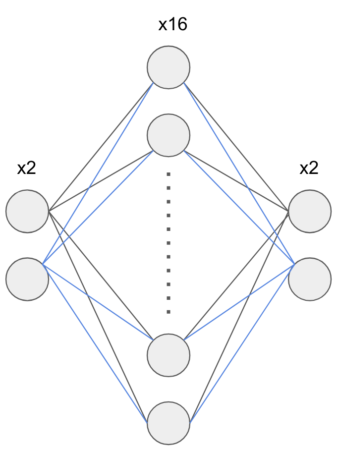

### AI
We will start with the `hello world` of machine learning, a `neural network` which predicts the output of a simple `XOR` gate.
Why XOR you ask? The reason is because the classes in XOR are not linearly separable. You cannot draw a straight line to separate the 
points (0,0),(1,1) from the points (0,1),(1,0), hence it's a perfect candidate for a simple AI project.

Our network has 3 layers: input, hidden and output. Input and output layers have 2 nodes while the hidden layer has 16 nodes. Although XOR could be classified under `Binary Classification` we are trying to solve it using `Multi-Class Classification`. Instead of having a single output representing the result, the 2 output layer nodes display the probability of either 0 or 1 being chosen as the XOR result.

### Usage
To train, save weights and query:
```
python xor_neural_network.py
```
To load previous weights and query:
```
python xor_neural_network.py l
```

### XOR Expected Output
| Input 1 | Input 2 | Output |
|---------|---------|--------|
| 0       | 0       | 0      |
| 0       | 1       | 1      |
| 1       | 0       | 1      |
| 1       | 1       | 0      |

#### Neural Network Diagram
